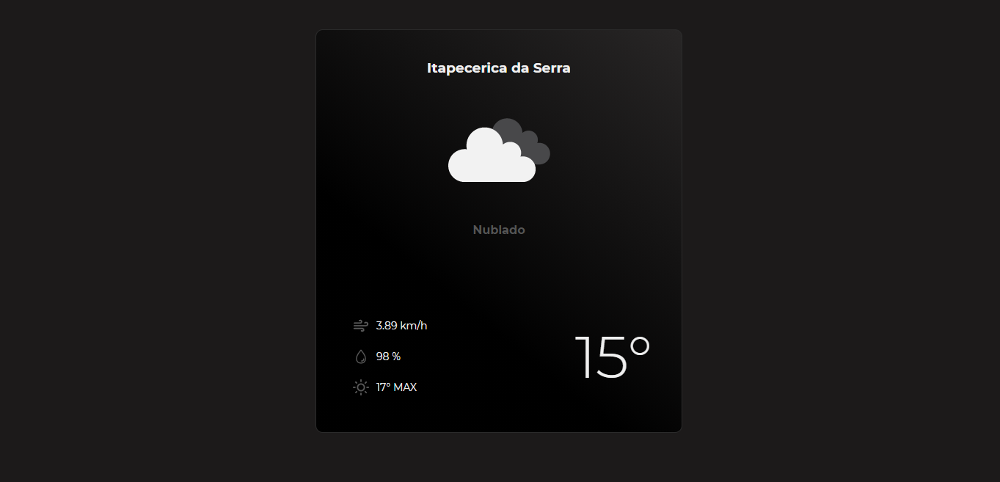
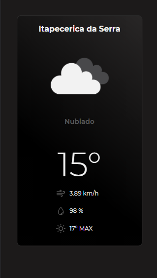

# Previsão do tempo web responsivo! :umbrella:
O projeto foi feito com o propósito de estudar requisições em API´s usando axios no ReactJS, como também serviu para estudar as Hooks useState e useEffect. Utilizei no projeto styled-components e react-icons. 

## Imagem do projeto em ambiente desktop: :computer:

## Imagens do projeto em celulares: :iphone:

## Rodando o projeto :white_check_mark:

Com esse projeto eu consegui aprender a como usar o instalador de pacotes Yarn, que é mais otimizado que o npm. Primeiro nos clonamos o projeto com o seguinte comando:

### `git clone` + o link do repositório

Depois de ter clonado o repositório, rode o seguinte comando para baixar todas as dependências do projeto:

### `yarn install`

Pronto, agora é só rodar o projeto direto da sua máquina! :wink:

Use o seguinte comando:

### `yarn start`
